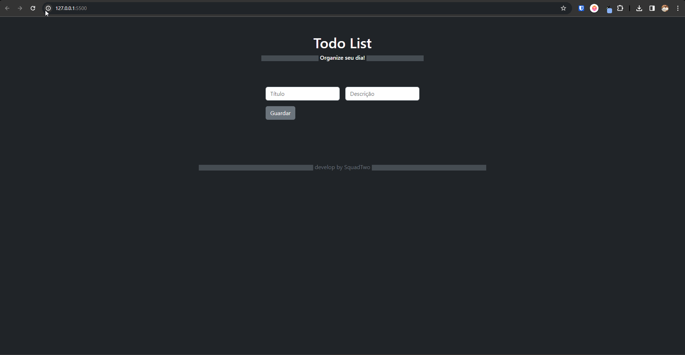

# TodoList

O projeto TodoList foi desenvolvido como requisito de conclusão do módulo Javascript da bolsa de estudos Santander Coders 2023/2. 
<br>
Turma: 1121
<br>
<br>
Este projeto apresenta uma versão de lista de tarefas desenvolvido com acessibilidade e com diversas funcionalidades.
<br>
<br>


## Live Demo
Acesse [aqui](https://arthurcaaldas.github.io/Project_TodoList/) o TodoList para experimentar a aplicação!
<br>
<br>

## Ferramentas e Tecnologias

- JS Vanilla
- HTML 5
- Bootstrap
- Github Actions
- Eslint & Prettier
  <br>

## 🚀 Iniciando com fins de Teste

Estas instruções abaixo permitirão que você obtenha uma cópia do projeto em operação na sua máquina local.

### 🔗 Clonar o Repositório

<br>

```bash

git clone https://github.com/keodevspace/Project_TodoList.git

```

## 📋 Pré-requisitos

Antes de começar, certifique-se de ter os seguintes requisitos instalados em sua máquina:

1. **Git:** [Download e Instalação do Git](https://git-scm.com/book/pt-br/v2/Come%C3%A7ando-Instalando-o-Git)

2. **Node.js e npm (Node Package Manager):** [Download e Instalação do Node.js e npm](https://nodejs.org/)

3. **Visual Studio Code (opcional, mas recomendado):** [Download e Instalação do Visual Studio Code](https://code.visualstudio.com/)
   <br>

Certifique-se de seguir as instruções de instalação adequadas para o sistema operacional que você está usando.

Após a instalação, você pode verificar se o Git e o Node.js foram instalados corretamente usando os seguintes comandos no terminal:
<br>

```bash
git --version
node --version
npm --version
```

## ⚙️ Executando os Testes

Para testar o seu website localmente utilizando o Live Server no Visual Studio Code, siga os passos abaixo:
<br>

1. **Instale a Extensão Live Server:**

   - Caso ainda não tenha a extensão Live Server instalada, você pode encontrá-la na [Visual Studio Code Marketplace](https://marketplace.visualstudio.com/items?itemName=ritwickdey.LiveServer).
     <br>

2. **Abra o Arquivo HTML Principal:**

   - Certifique-se de que o seu arquivo HTML principal está aberto no Visual Studio Code.
     <br>

3. **Inicie o Live Server:**
   - Clique com o botão direito do mouse no arquivo HTML aberto.
   - Selecione a opção "Open with Live Server".
     <br>

O Live Server iniciará um servidor local e abrirá o seu website no navegador padrão. Qualquer alteração que você fizer nos arquivos do projeto será automaticamente refletida no navegador.
<br>
<br>
Certifique-se de testar as diferentes funcionalidades e visualizar o seu website localmente antes de implantar na branch main.
<br>
<br>

## 📌 Versão

#v1.0<br><br>
Usamos Git para controle de versão. Para as versões disponíveis, observe as tags neste repositório.
<br>
<br>

## ✒️ Desenvolvedores

1. [Arthur Caldas](https://github.com/arthurcaaldas)

2. [Cleiton Sena](https://github.com/CleitonSena21)

3. [Kauã Cunha](https://github.com/Kaua-da-Cunha-Rodrigues)

4. [Keo Coelho](https://github.com/keodevspace)
